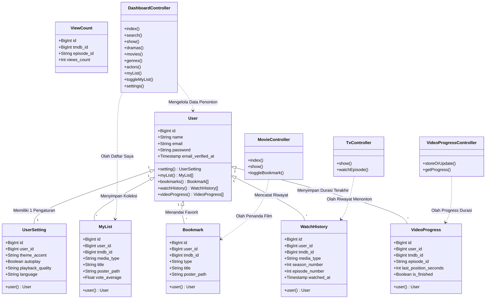

# 🏛️ Class Diagram (UML) - Platform Streaming Mubee (Tugas 1)

Dokumen ini berisi **Class Diagram (UML)** yang menggambarkan struktur kelas data (*Eloquent Models*) dan pengontrol sistem (*Controllers*) yang ada pada aplikasi **Mubee (K-Drama & K-Movie Streaming Platform)** beserta hubungan antar kelasnya.

---

## 📐 Diagram Kelas (Class Diagram)

---

## 💡 Penjelasan Kelas Data & Pengontrol (Bahasa Awam)

### 👤 1. Kelas Data Utama (*Models*)
* **User (Akun Penonton)**: Menyimpan data dasar akun pengguna seperti ID, nama, alamat email, dan kata sandi yang telah dienkripsi.
* **UserSetting (Pengaturan Pengguna)**: Menyimpan pilihan warna layar (tema), setelan kualitas gambar video, dan opsi putar otomatis. Setiap 1 penonton memiliki 1 pengaturan.
* **MyList (Daftar Favorit Saya)**: Menyimpan judul-judul film atau drama Korea yang dimasukkan oleh penonton ke dalam daftar simpanan.
* **Bookmark (Penanda Cepat)**: Menyimpan penanda film yang disukai penonton untuk dibuka kembali dengan cepat.
* **WatchHistory (Riwayat Menonton)**: Catatan histori judul film, episode, dan jam kapan penonton menyaksikan tayangan tersebut.
* **VideoProgress (Durasi Terakhir)**: Menyimpan titik detik terakhir saat penonton berhenti/pause menonton agar tayangan bisa dilanjutkan (*Continue Watching*).
* **ViewCount (Total Penonton)**: Menghitung total berapa kali suatu film atau episode drama telah ditonton oleh seluruh pengguna.

---

### ⚙️ 2. Kelas Pengontrol Logika (*Controllers*)
* **DashboardController**: Pengatur utama layar aplikasi (menampilkan film yang sedang tren, filter genre, pencarian judul, dan daftar aktor oppa/eonni).
* **MovieController**: Pengatur khusus pemutaran dan informasi detail film layar lebar (K-Movie).
* **TvController**: Pengatur pemutaran episode dan musim serial drama Korea (K-Drama).
* **VideoProgressController**: Pengatur simpan-otomatis titik durasi tontonan secara *real-time* lewat belakang layar (*AJAX*).
