# 🎨 Perancangan Wireframe Block Layout Halaman - Platform Streaming Mubee

Dokumen ini berisi **Perancangan Gambar Tata Letak Halaman (Visual Wireframe Block Layout Diagram)** untuk setiap halaman pada aplikasi **Mubee (K-Drama & K-Movie Streaming Platform)** yang digambar dalam format **Mermaid.js** sesuai dengan diagram struktur blok UI/UX.

---

## 🗺️ 1. Pemetaan Struktur Router & Controller

| URL Route | Controller & Action | Nama Halaman | Komponen UI Utama |
| :--- | :--- | :--- | :--- |
| `/login` | `LoginController@showLoginForm` | Login Page | Logo, Input Email/Password, Button Submit, Register Link |
| `/register` | `RegisterController@showRegistrationForm` | Register Page | Logo, Input Name/Email/Pass, Button Submit, Login Link |
| `/` | `DashboardController@index` | Beranda (Home) | Logo + Search, Menu Navigasi, Big Feature Hero, Riwayat Tontonan, Small Features Grid, Sidebar, Footer |
| `/dramas` | `DashboardController@dramas` | Serial Drama | Header Nav, Page Title, Drama Grid Cards (Ongoing/Completed), Footer |
| `/movies` | `DashboardController@movies` | Film Korea | Header Nav, Page Title, Movie Grid Cards, Sidebar Highlight, Footer |
| `/genres` | `DashboardController@genres` | Kategori Genre | Header Nav, Genre Hero Select, Category Cards, Filtered Grid, Footer |
| `/actors` | `DashboardController@actors` | Aktor & Aktris | Header Nav, Hero Banner, Search Actor, Actor Cards Grid, Works Modal, Footer |
| `/my-list` | `DashboardController@myList` | Daftar Tontonan | Header Nav, Page Title, My List Grid Cards, Remove Button, Empty Notice, Footer |
| `/search` | `DashboardController@search` | Hasil Pencarian | Header Nav + Search Active, Results Grid, Query Status, Footer |
| `/settings` | `DashboardController@settings` | Pengaturan | Header Nav, User Profile Card, Accent Theme Picker, Player Quality, Footer |
| `/shows/{type}/{id}` | `DashboardController@show` | Detail Konten | Header + Back Btn, Hero Backdrop, Poster Card, Metadata, Seasons/Episodes, Recs, Footer |
| `/movies/{id}` | `MovieController@show` | Pemutar Film | Header Nav, VidSrc Embed Player Frame, Server Select, Synopsis, Recs, Footer |
| `/tv/{id}/watch/{s}/{e}`| `TvController@watchEpisode` | Pemutar Drama TV | Header Nav, VidSrc Embed Player Frame, Prev/Next Episode Nav, Episode Selector Grid, Sync Script |

---

## 📐 2. Perancangan Wireframe Block Layout Setiap Halaman (Mermaid.js)

---

### 2.1. Halaman Beranda Utama (`/`) - Home Layout

Halaman utama memiliki tata letak blok yang terdiri dari **Header (Logo & Search)**, **Menu Navigasi**, **Big Feature Hero Banner**, **Riwayat Tontonan (Recent Post)**, **Small Features Grid (Katalog Tren & Drama)**, **Sidebar Kanan**, dan **Footer**.

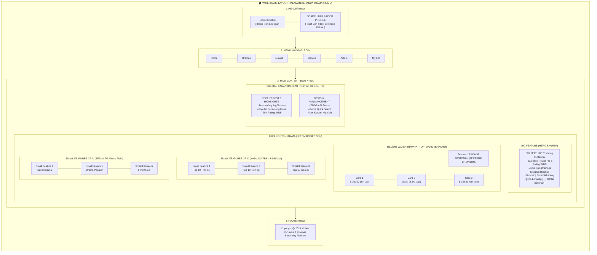

---

### 2.2. Halaman Serial Drama (`/dramas`)

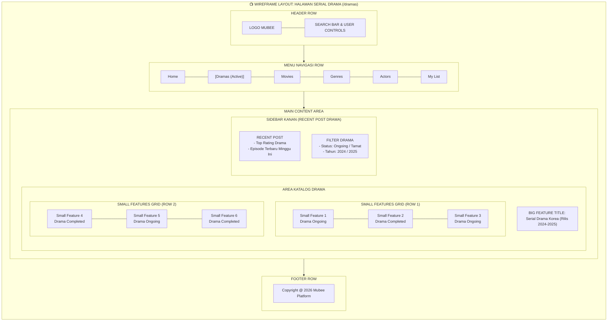

---

### 2.3. Halaman Film Korea (`/movies`)

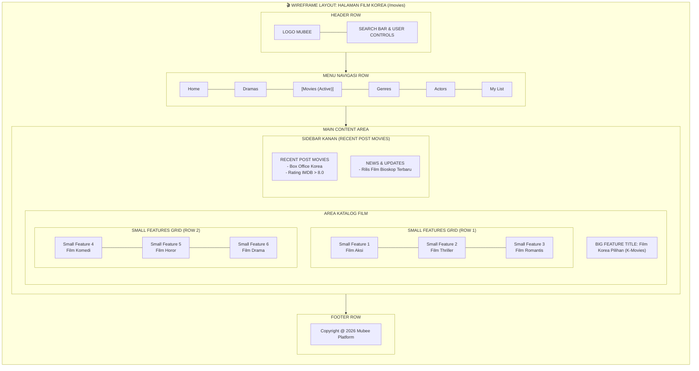

---

### 2.4. Halaman Kategori Genre (`/genres`)

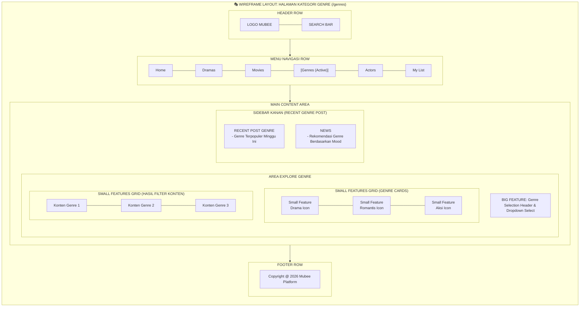

---

### 2.5. Halaman Aktor & Aktris Populer (`/actors`)

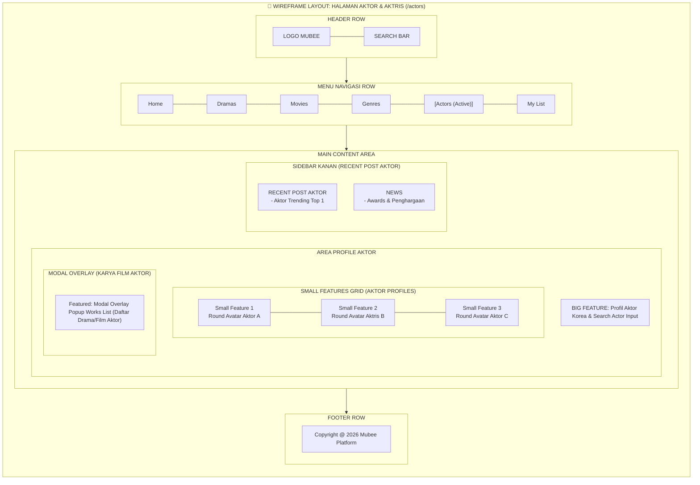

---

### 2.6. Halaman Daftar Tontonan Saya (`/my-list`)

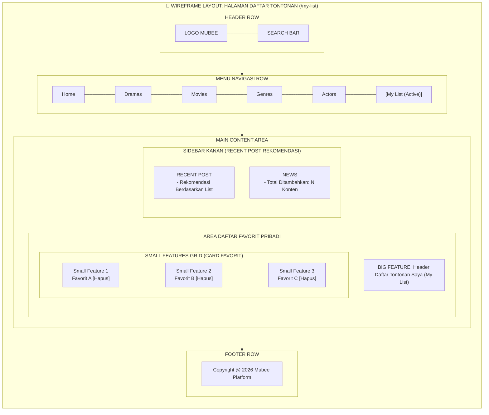

---

### 2.7. Halaman Hasil Pencarian (`/search`)

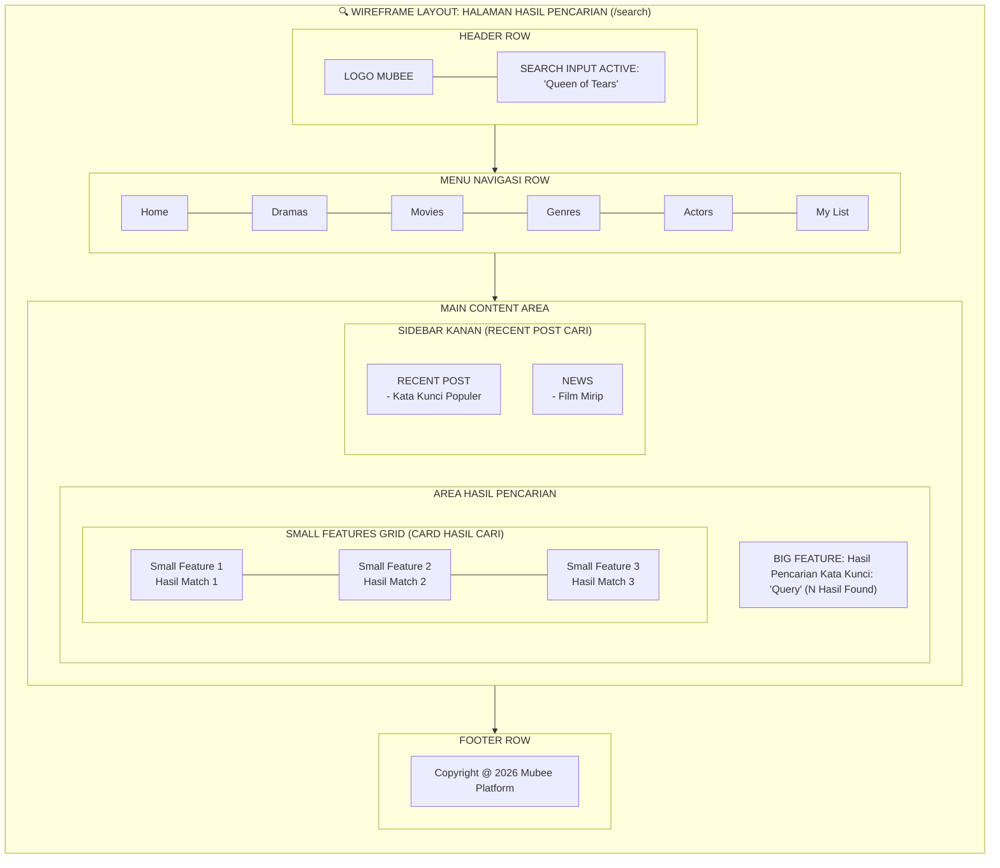

---

### 2.8. Halaman Pengaturan / Settings (`/settings`)

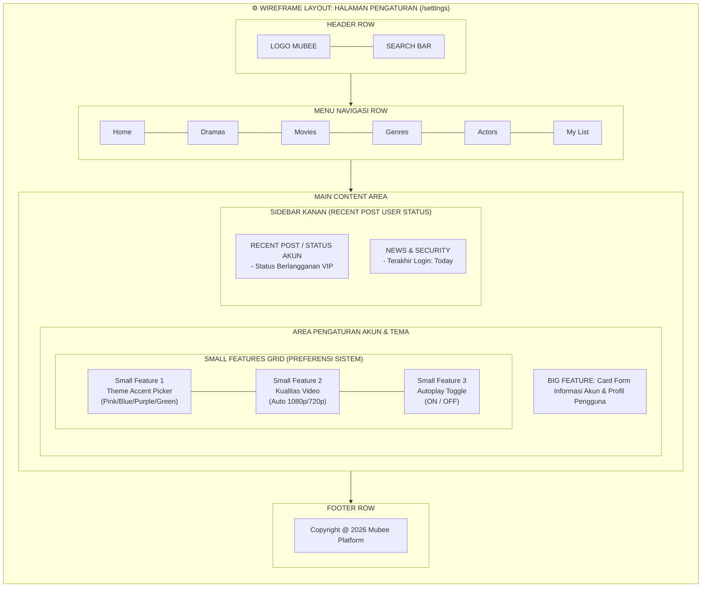

---

### 2.9. Halaman Detail Konten (`/shows/{type}/{id}`)

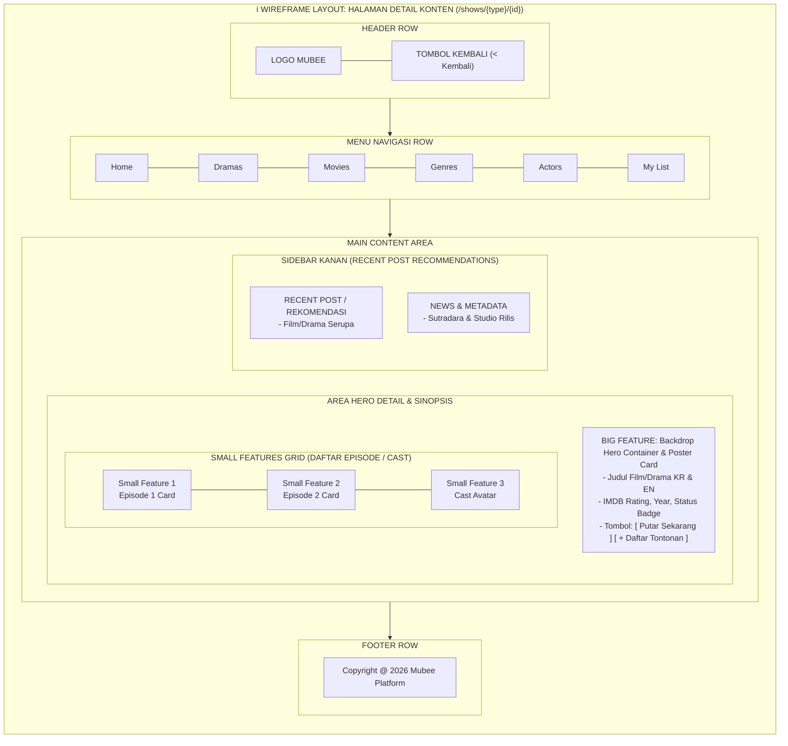

---

### 2.10. Halaman Pemutar Film (`/movies/{id}`) & Episode TV (`/tv/{id}/watch/{s}/{e}`)

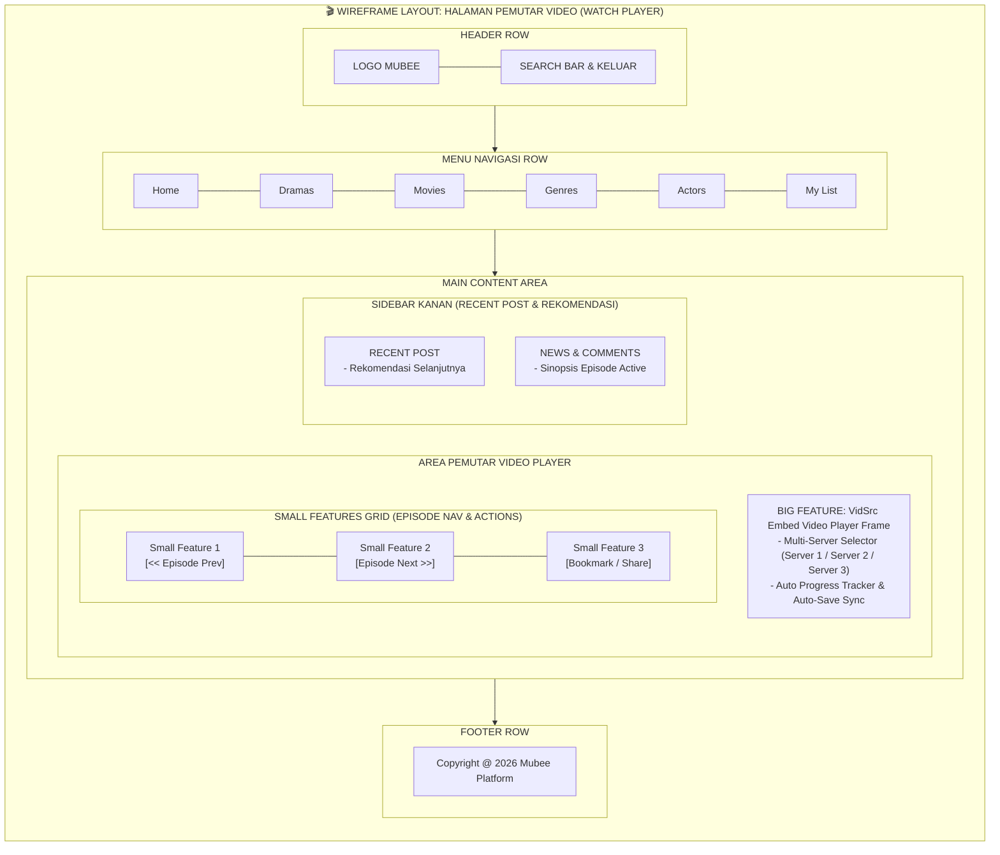

---

### 2.11. Halaman Login / Masuk Akun (`/login`)

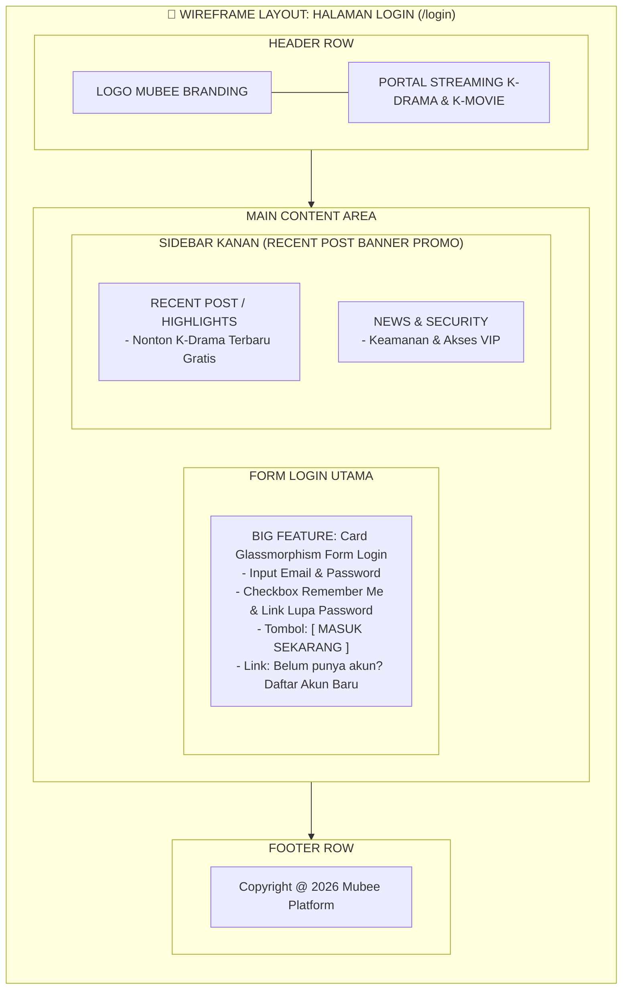

---

### 2.12. Halaman Register / Buat Akun Baru (`/register`)

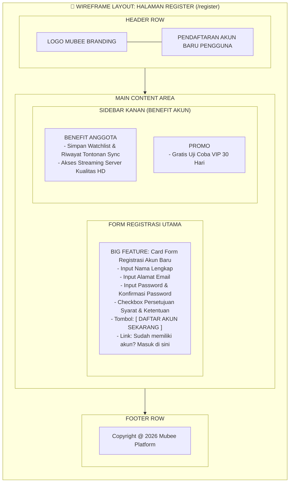

---

## 📌 Kesimpulan Pemetaan Layout

Dengan gambar perancangan **Wireframe Block Layout** berbasis **Mermaid.js** di atas:
1. Setiap halaman pada aplikasi **Mubee** dipetakan sesuai dengan spesifikasi gambar yang diberikan:
   - **Header Row** (Logo & Search Bar)
   - **Menu Navigasi Row** (Baris Menu Utama)
   - **Big Feature Box** (Area Utama Banner / Player / Form)
   - **Recent Post / Watch History Box** (Area Riwayat Tontonan & Highlight Sidebar)
   - **Small Features Grid Boxes** (Grid Baris Kartu Konten / Kategori / Profil Aktor)
   - **Sidebar Kanan (Recent Post & News)**
   - **Footer Row** (Copyright)
2. Dokumentasi ini secara visual menggambarkan posisi tata letak UI/UX yang konsisten untuk seluruh rute dan pengontrol aplikasi.
