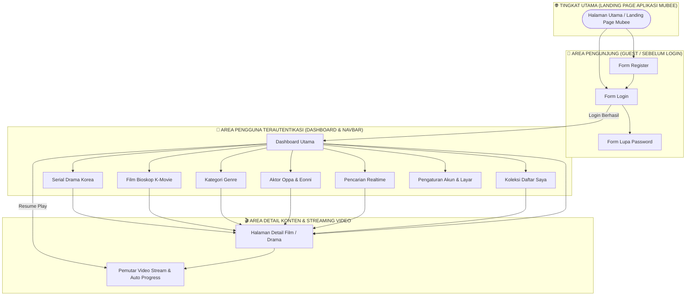

# 🧭 Pemodelan Struktur Navigasi Aplikasi Mubee (Tugas 1)

Dokumen ini berisi perancangan **Struktur Navigasi (Navigation Structure)** untuk aplikasi **Mubee (Platform Streaming Film & Drama Korea Berbasis Website)**. Sistem ini menerapkan **Struktur Navigasi Campuran (Composite Navigation)**, yang mengombinasikan alur linier/hirarki (*Authentication ke Dashboard ke Player*) dan alur non-linier (*Bebas navigasi via Navbar*).

---

## 📐 1. Diagram Pohon Struktur Navigasi Utama

---

## 📋 2. Tabel Matriks Struktur Navigasi Halaman

Tabel di bawah ini menjelaskan fungsionalitas, alur perpindahan, dan tujuan dari setiap kode halaman pada aplikasi Mubee:

### 🔐 A. Tingkatan Autentikasi Pengunjung (Guest Level)
| Kode Halaman | Nama Halaman / Menu | Fungsi Utilitas Halaman | Halaman Tujuan Selanjutnya |
| :---: | :--- | :--- | :--- |
| **H-01** | Halaman Login | Memasukkan email & password untuk masuk ke aplikasi | Dashboard Utama (`H-04`) |
| **H-02** | Halaman Registrasi | Mendaftarkan akun penonton baru | Halaman Login (`H-01`) |
| **H-03** | Halaman Lupa Password | Mengajukan pemulihan kata sandi akun | Halaman Login (`H-01`) |

---

### 👤 B. Tingkatan Beranda & Kategori Navigasi (Dashboard Level)
| Kode Halaman | Nama Halaman / Menu | Fungsi Utilitas Halaman | Halaman Tujuan Selanjutnya |
| :---: | :--- | :--- | :--- |
| **H-04** | Dashboard Utama | Pusat rekomendasi film tren, banner hot, & continue watching | Seluruh Menu Navbar & Detail Film |
| **H-05** | Serial Drama Korea | Katalog serial K-Drama terpopuler rilis terbaru | Halaman Detail Film (`H-12`) |
| **H-06** | Film Bioskop (K-Movie) | Katalog film layar lebar Korea Selatan | Halaman Detail Film (`H-12`) |
| **H-07** | Kategori Genre | Filter tayangan berdasarkan genre (Romance, Action, dsb) | Halaman Detail Film (`H-12`) |
| **H-08** | Aktor & Aktris Favorit | Katalog profil & karya pemain drama Oppa & Eonni | Halaman Detail Film (`H-12`) |
| **H-09** | Pencarian Real-time | Mencari judul film/drama atau nama pemain secara langsung | Halaman Detail Film (`H-12`) |
| **H-10** | Koleksi Daftar Saya | Menampilkan daftar tayangan simpanan favorit pengguna | Halaman Detail Film (`H-12`) |
| **H-11** | Pengaturan Akun | Menyesuaikan tema warna layar, kualitas video, & bahasa | Dashboard Utama (`H-04`) |

---

### 🎬 C. Tingkatan Detail Konten & Pemutar Video (Streaming Level)
| Kode Halaman | Nama Halaman / Menu | Fungsi Utilitas Halaman | Halaman Tujuan Selanjutnya |
| :---: | :--- | :--- | :--- |
| **H-12** | Halaman Detail Film | Menampilkan sinopsis lengkap, skor IMDB, cast, & trailer | Player Stream Video (`H-13`) |
| **H-13** | Player Stream Video | Memutar video stream & otomatis menyimpan detik menit tontonan | Dashboard / Halaman Detail |
