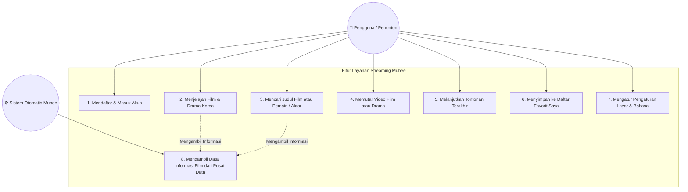
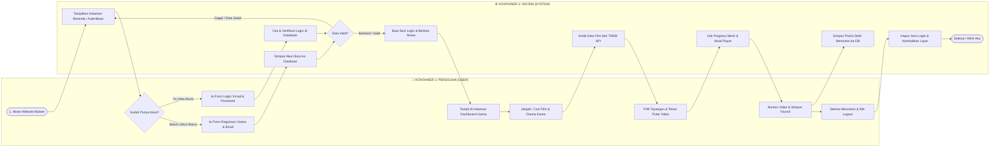

# 🎬 Dokumen Sistem & Diagram Layanan Streaming Mubee (Tugas 1)

Dokumen ini berisi dokumentasi diagram dan perancangan basis data untuk aplikasi pemutaran film dan drama Korea (Mubee). Seluruh penjelasan dibuat menggunakan bahasa umum yang mudah dipahami oleh pengguna awam.

---

## 📌 1. Use Case Diagram (Hak Akses & Alur Pengguna)

Use Case Diagram menggambarkan fitur-fitur utama yang dapat dilakukan oleh **Pengguna (Penonton)** di dalam aplikasi serta bagaimana **Sistem Mubee** bekerja secara otomatis mengambil informasi film.

### 💡 Penjelasan Sederhana Use Case:
1. **Mendaftar & Masuk Akun**: Penonton membuat akun baru atau masuk ke aplikasi agar pilihan tontonan favoritnya bisa tersimpan rapi.
2. **Menjelajah Film & Drama**: Penonton dapat melihat daftar film yang sedang tren, serial drama Korea rilis terbaru, atau memilih berdasarkan genre.
3. **Mencari Judul Film / Aktor**: Penonton bisa mengetikkan nama aktor/aktris favorit (seperti pemain drama populer) atau judul film untuk langsung menemukannya.
4. **Memutar Video**: Penonton menekan tombol putar untuk menyaksikan film atau episode drama di layar secara langsung.
5. **Melanjutkan Tontonan Terakhir (*Continue Watching*)**: Jika penonton berhenti di tengah jalan, sistem akan ingat menit terakhir dan menawarkan tombol untuk langsung melanjutkan tontonan.
6. **Menyimpan ke Daftar Favorit**: Penonton dapat menekan tombol tambah (`+`) untuk mengumpulkan film-film yang ingin ditonton di kemudian hari.
7. **Mengatur Layar & Bahasa**: Penonton bisa menentukan preferensi seperti memutar otomatis episode berikutnya dan kualitas video.
8. **Mengambil Data Informasi Film**: Sistem secara otomatis menghubungkan aplikasi dengan database pusat film dunia (*TMDB*) untuk menampilkan sinopsis, rating, poster, dan nama pemain.

---

## 🔄 2. Activity Diagram (Alur Swimlane 2 Kontainer: User & System)

Diagram aktivitas di bawah ini dibagi menjadi **2 Kontainer (Swimlane)**, yaitu **Kontainer 1 (User / Penonton)** dan **Kontainer 2 (System / Backend Mubee)**. Diagram ini menggambarkan seluruh alur mulai dari penonton pertama kali membuka website, membuat akun/login, memutar film, hingga penonton keluar (*logout*).

### 💡 Penjelasan Alur Aktivitas Lengkap (Langkah demi Langkah):
1. **Langkah 1 (Buka Website)**: Penonton mengakses alamat website Mubee. Sistem merespons dengan menampilkan halaman utama / pilihan masuk.
2. **Langkah 2 (Pilihan Autentikasi)**: 
   * Jika penonton sudah punya akun, penonton memilih **Login** dan mengisikan email serta kata sandi.
   * Jika penonton baru, penonton memilih **Buat Akun (Register)** dan mengisikan nama, email, serta kata sandi.
3. **Langkah 3 (Pemeriksaan Sistem)**: Sistem memeriksa kebenaran data di basis data. Jika berhasil, sistem membuatkan tiket akses sesi (*session login*) dan membawa penonton masuk ke Halaman Dashboard Utama.
4. **Langkah 4 (Menjelajah & Memutar)**: Penonton menjelajah film yang sedang populer atau mencari nama pemain drama favorit. Sistem mengambil informasi lengkap sinopsis dan gambar poster dari katalog pusat film (*TMDB API*).
5. **Langkah 5 (Pemutaran & Auto Progress)**: Saat penonton menekan tombol putar, sistem memeriksa durasi detik terakhir penonton. Video mulai diputar dan sistem secara otomatis menyimpan titik menit tontonan terakhir ke basis data (*Video Progress*).
6. **Langkah 6 (Keluar Akun / Logout)**: Setelah selesai menonton, penonton menekan tombol **Logout**. Sistem langsung menghapus tiket sesi login dan mengarahkan kembali penonton ke halaman login.

---

## 🗃️ 3. Database System (Struktur Data & Tabel Basis Data)

Berikut adalah struktur 7 tabel utama yang digunakan untuk menyimpan data pengguna, riwayat tontonan, koleksi favorit, dan pengaturan aplikasi.

---

### 📋 Tabel 1: `users` (Data Akun Pengguna)
> Berisi data informasi akun penonton yang terdaftar di dalam aplikasi.

| Nama Kolom | Tipe Data | Panjang | Keterangan |
| :--- | :--- | :--- | :--- |
| `id` | BigInt | 20 | Nomor identitas unik khusus untuk setiap penonton |
| `name` | Varchar | 255 | Nama lengkap penonton |
| `email` | Varchar | 255 | Alamat email resmi penonton (digunakan untuk login) |
| `email_verified_at` | Timestamp | - | Tanggal dan waktu saat email berhasil diverifikasi |
| `password` | Varchar | 255 | Kata sandi rahasia akun yang disamarkan (diacak demi keamanan) |
| `remember_token` | Varchar | 100 | Kode rahasia agar penonton tidak perlu login berulang kali |
| `created_at` | Timestamp | - | Waktu dan tanggal saat akun pertama kali dibuat |
| `updated_at` | Timestamp | - | Waktu dan tanggal saat data akun terakhir diubah |

---

### 📋 Tabel 2: `user_settings` (Pengaturan Akun & Tampilan)
> Menyimpan preferensi pilihan tampilan layar dan pemutaran video sesuai selera penonton.

| Nama Kolom | Tipe Data | Panjang | Keterangan |
| :--- | :--- | :--- | :--- |
| `id` | BigInt | 20 | Nomor identitas unik baris pengaturan |
| `user_id` | BigInt | 20 | Nomor identitas penonton pemilik pengaturan ini |
| `theme_accent` | Varchar | 50 | Warna nuansa aplikasi pilihan penonton (misal: Merah Mubee) |
| `autoplay` | TinyInt / Boolean | 1 | Pilihan otomatis putar episode lanjutannya (1 = Aktif, 0 = Mati) |
| `playback_quality` | Varchar | 20 | Kualitas jernihnya gambar video (seperti: Otomatis, HD, SD) |
| `language` | Varchar | 10 | Bahasa teks petunjuk aplikasi (misal: `id` untuk Bahasa Indonesia) |
| `created_at` | Timestamp | - | Tanggal pengaturan pertama kali disimpan |
| `updated_at` | Timestamp | - | Tanggal perubahan pengaturan terakhir kali |

---

### 📋 Tabel 3: `my_lists` (Koleksi Favorit / Daftar Saya)
> Berisi daftar film dan drama Korea yang disimpan penonton untuk ditonton nanti.

| Nama Kolom | Tipe Data | Panjang | Keterangan |
| :--- | :--- | :--- | :--- |
| `id` | BigInt | 20 | Nomor identitas unik baris simpanan favorit |
| `user_id` | BigInt | 20 | Nomor identitas penonton yang menyimpan film |
| `tmdb_id` | BigInt | 20 | Nomor kode unik film/drama dari katalog film dunia |
| `media_type` | Varchar | 20 | Kategori tontonan (misal: `movie` untuk Film, `tv` untuk Drama Seri) |
| `title` | Varchar | 255 | Judul film atau nama drama Korea |
| `poster_path` | Varchar | 255 | Alamat link gambar sampul/poster film |
| `vote_average` | Decimal | 3,1 | Nilai skor atau rating bintang tayangan (contoh: 8.5) |
| `created_at` | Timestamp | - | Tanggal film ditambahkan ke daftar simpanan |
| `updated_at` | Timestamp | - | Tanggal informasi simpanan diperbarui |

---

### 📋 Tabel 4: `bookmarks` (Penanda Film Sering Ditonton)
> Menyimpan film yang ditandai atau diberi pin cepat oleh penonton.

| Nama Kolom | Tipe Data | Panjang | Keterangan |
| :--- | :--- | :--- | :--- |
| `id` | BigInt | 20 | Nomor identitas unik data penanda |
| `user_id` | BigInt | 20 | Nomor identitas penonton |
| `tmdb_id` | BigInt | 20 | Nomor kode unik tayangan di katalog pusat |
| `type` | Varchar | 20 | Jenis tontonan (Film atau Drama Seri) |
| `title` | Varchar | 255 | Judul resmi tayangan |
| `poster_path` | Varchar | 255 | Alamat file gambar gambar sampul film |
| `created_at` | Timestamp | - | Tanggal tayangan ditandai sebagai favorit |
| `updated_at` | Timestamp | - | Tanggal penandaan diperbarui |

---

### 📋 Tabel 5: `watch_history` (Catatan Riwayat Menonton)
> Mencatat tayangan apa saja yang pernah ditonton oleh penonton beserta episodenya.

| Nama Kolom | Tipe Data | Panjang | Keterangan |
| :--- | :--- | :--- | :--- |
| `id` | BigInt | 20 | Nomor identitas unik baris riwayat |
| `user_id` | BigInt | 20 | Nomor identitas penonton yang menonton |
| `tmdb_id` | BigInt | 20 | Nomor kode unik tayangan dari katalog pusat |
| `media_type` | Varchar | 20 | Kategori tayangan (Film bioskop atau Serial Drama) |
| `season_number` | Integer | 11 | Urutan musim / season drama yang diputar (misal: Musim 1) |
| `episode_number` | Integer | 11 | Urutan episode drama yang diputar (misal: Episode 5) |
| `watched_at` | Timestamp | - | Tanggal dan jam pertama kali tontonan dimulai |
| `last_watched_at` | Timestamp | - | Tanggal dan jam terakhir kali tontonan ini dibuka |

---

### 📋 Tabel 6: `video_progress` (Posisi Menit Menonton Terakhir)
> Menyimpan titik detik terakhir penonton berhenti agar tontonan bisa dilanjutkan tanpa mengulang dari awal.

| Nama Kolom | Tipe Data | Panjang | Keterangan |
| :--- | :--- | :--- | :--- |
| `id` | BigInt | 20 | Nomor identitas unik rekaman durasi |
| `user_id` | BigInt | 20 | Nomor identitas penonton |
| `tmdb_id` | BigInt | 20 | Nomor kode unik tayangan di katalog |
| `episode_id` | Varchar | 50 | Kode identitas spesifik episode atau film yang ditonton |
| `last_position_seconds` | Integer | 11 | Posisi titik detik terakhir saat tayangan distop/dipause |
| `is_finished` | TinyInt / Boolean | 1 | Penanda status tontonan (1 = Sudah tamat/selesai, 0 = Belum selesai) |
| `created_at` | Timestamp | - | Tanggal rekaman durasi dibuat |
| `updated_at` | Timestamp | - | Tanggal dan waktu detik terakhir disinkronkan secara otomatis |

---

### 📋 Tabel 7: `view_counts` (Jumlah Total Penonton Tayangan)
> Menghitung seberapa populer suatu tayangan berdasarkan akumulasi total tayangan seluruh penonton.

| Nama Kolom | Tipe Data | Panjang | Keterangan |
| :--- | :--- | :--- | :--- |
| `id` | BigInt | 20 | Nomor identitas unik data statistik |
| `tmdb_id` | BigInt | 20 | Nomor kode unik tayangan di katalog pusat |
| `episode_id` | Varchar | 50 | Kode identitas episode spesifik |
| `views_count` | Integer | 11 | Total jumlah akumulasi berapa kali tayangan ini diputar oleh semua pengguna |
| `created_at` | Timestamp | - | Tanggal statistik pertama kali dihitung |
| `updated_at` | Timestamp | - | Tanggal jumlah penonton terakhir bertambah |
